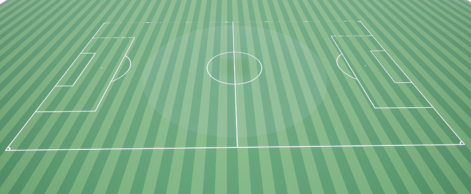

## Procedural soccer field

This is an Actor for easy and fast soccer field generation based on Spline.  

Football rules set the limits within which elements of a football field can change.  
Parameters of the pitch can have a direct impact on the strategies used by teams, which can affect the final result of the game.   
For this reason, a system is needed to quickly and conveniently change these parameters.

This asset can be developed further. To do this, a  generator should be added to  create grass of the desired color to 
fill the pitch  and markup in accordance with the specified settings.

Parameters that can be adjusted:
- Markup line thickness;
- Field size;
- Penalty area size;
- Goal area size;
- Penalty mark location;
- Central circle radius;
- Penalty/Corner arc radius;
- Number width, color of grass lines.

### Video Showcase:

